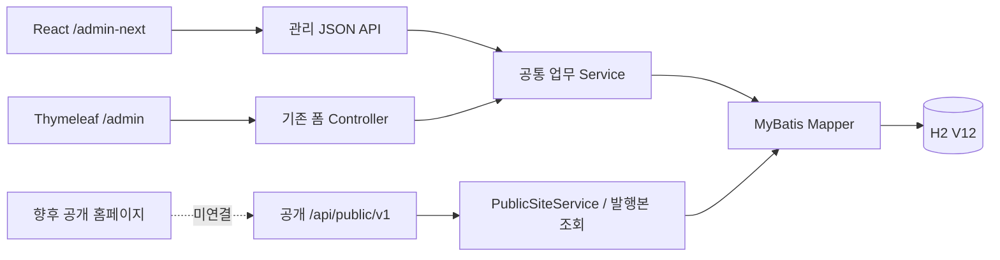

# 04. 개발자 인수인계 가이드

현재 납품 기술 범위는 단일 Spring 서버 안의 React/Thymeleaf 관리자, CMS 업무 서비스, H2 schema V12, 발행본 전용 공개 API다. 기준점은 [V12 안정 기준점](../../V12_STABLE_BASELINE.md)이며, 이 문서의 V10 표현은 작성 당시 기준이다. V12는 Thymeleaf → React 전환 작업의 비교 기준이다. 실제 공개 홈페이지 프런트엔드는 없다. 인수 업체는 기존 데이터/ID·권한·발행 경계를 유지하며 이어받는다.

## 아키텍처와 실행물

- Java 17, Spring Boot 3.4.5, MyBatis 3.5.16 / mybatis-spring 3.0.4, Thymeleaf, Spring Security를 사용한다. 좁은 범위의 eGovFrame RTE 4.3.0 모듈을 유지한다.
- 고정 RC의 파일 DB는 H2 2.3.232, Flyway 10.20.1이다. 이번 문서 작성으로 의존성을 바꾸지 않았다.
- `frontend/package.json` 기준 React 19.3.0, TypeScript 7.0.2, Vite 8.3.1, Quill 2.0.3, pnpm 11.19.0이다. 소스 재빌드는 운영 RC 교체 승인과 별개다.
- Vite 산출물을 `src/main/resources/static/next-app`에 넣고 Spring JAR에 포함한다. 운영 시 별도 Vite/Node 서버가 필요하지 않다.

## 코드·업무·저장 구조 지도

아래 Java 경로는 `src/main/java/egovframework/backoffice/mvp/`, Mapper는 `src/main/resources/mapper/` 기준이다.

| 영역 | 주요 코드 | 실제 저장/책임 |
|---|---|---|
| React 셸·탐색 | `frontend/src/main.tsx`, `navigation.ts`, `useWorkspaceRoutes.ts`, `blockNavigation.ts` | URL/view, 방문 편집기 상태, 미저장 보호; 별도 콘텐츠 저장소 없음 |
| 콘텐츠 편집 | `ContentEditor.tsx`, `NextPostApi`, `PostService`, `PostMapper.xml` | posts 원본, 기존 category_id, revision, post_media |
| 페이지 편집 | `PageEditor.tsx`, `NextPageApi`, `PageService`, `CmsMapper.xml` | site_pages.sections_json 초안 전체를 한 번에 저장 |
| 블록 식별·검증 | `PageBlockService`, `PageComponentRegistry`, `PageBlockMapper.xml` | page_block_identities; 페이지 소유·은퇴 ID·타입/schema/Variation 검증 |
| POSTS 조회 | `PublishedPostQueryService`, `CmsMapper.xml` | category/query/manual 공통 발행본 조회, EXISTS 기반 분류 필터 |
| 분류 | `ClassificationService`, `ClassificationMapper.xml` | content_types, cohorts, topics, content_type_topics, 초안/발행 관계 테이블 |
| 맛집 | `RestaurantDetailsService`, `RestaurantMapper.xml` | post_restaurant_details / post_publication_restaurant_details, 주소만 |
| 페이지 템플릿(구 공용 템플릿) | `PageTemplates.tsx`, `NextTemplateApi`, `PageTemplateService`, `PageTemplateMapper.xml` | page_templates.blocks_json, 별도 revision; 페이지와 실시간 관계 없음 |
| React 게시·재게시(V11) | `ContentEditor.tsx`, `NextPostApi` `POST /posts/{id}/publish`, `PostService` | 기존 저장/게시 트랜잭션 재사용 |
| 휴지통(V11) | `TrashPanel.tsx`, `NextPostApi` `/trash`, `PostService`, `PostMapper.xml`/`CmsMapper.xml` | post_trash; 이동·복원·영구삭제, SUPER_ADMIN |
| 새 페이지 생성 | `CreatePageDraft.tsx`, `pageCreation.ts`, 기존 `POST /admin/pages/save-json` | 서버/DB 변경 없음; 빈 임시보관 페이지 |
| 글쓰기 템플릿(V12) | `WritingTemplatesPanel.tsx`, `PostTemplateTool.tsx`, `NextWritingTemplateApi`, `WritingTemplateService`, `WritingTemplateMapper.xml` | writing_templates(REVIEW만), revision; 적용 본문은 사본 |
| schema 전환 도구 | `V11PromotionTool`(V10→V11), `V12PromotionTool`(V11→V12), `FileDatabaseSafety.CURRENT_VERSION=12` | 정상 종료 DB의 별도 사본만 migrate, receipt 발급 |
| 미디어 | `MediaService`, `UsageService`, `TemplateReferences` | media BLOB/메타데이터, post_media/page_media 및 발행 참조 |
| 최신 공개본 | `PostService`, `PageService`, `PublicSiteService` | post_publications, page_publications 및 발행 미디어/분류/맛집 snapshot |
| 버전 이력 | `VersionHistoryService`, `VersionSnapshots`, `VersionStore`, `VersionMapper.xml` | post_versions/page_versions/page_template_versions의 불변 JSON snapshot |
| 버전 복구 | `VersionRestoreService`, `NextVersionApi`, `VersionHistoryDialog.tsx` | 기존 저장 서비스 재사용; 복구 전/후 버전과 초안 변경을 같은 트랜잭션 |
| 미디어 과거 참조 | `VersionMediaReferences` | 대상별 version_media FK로 삭제 보호 |
| 활동 이력 | `ActivityService` | activity_log 작업 기록; 복원 원문 저장소 아님 |
| 메뉴·사이트 설정 | `SiteService`, `NextWorkspaceApi`, `CmsController` | site_menus/site_links/site_settings, 명시 저장, 별도 publication 없음 |
| 인증·계정 | `security/`, `account/` | users, auth_version, session, capability·소유권 검사 |
| 파일 DB 안전 실행 | `FileRuntimeConfiguration`, `FileDatabaseSafety`, `ClassificationMigrationConfiguration`, `CutoverTool` | writer 옵션 검사, 정확한 경로/RC receipt, 정상 서버 validate-only |

`CmsStore`와 MyBatis는 공통 SQL 호출 도구이며 새 업무 규칙을 컨트롤러에 복제할 이유가 아니다. 변경 작업은 기존 Service의 트랜잭션·잠금·revision 검증을 통해야 한다. 파일 DB를 다른 프로세스에서 동시에 쓰지 않는다.

## 관리자 API와 기존 폼 경계

기본 경로는 `/api/admin/next`다. 세션 쿠키와 변경 요청 CSRF가 필요하며 bootstrap으로 현재 사용자·권한·초기 데이터·CSRF 값을 얻는다. 이 값을 문서·로그에 저장하지 않는다.

| 경로/동작 | 책임 |
|---|---|
| GET `/bootstrap`, `/dashboard`, `/posts`, `/pages`, `/page-structure` | 셸·목록·실제 원본 탐색 |
| GET `/classifications`, `/page-components` | 등록된 사전/개발자 정의 조회; 운영 등록 API 아님 |
| POST `/posts`, GET/PUT `/posts/{id}` | 초안 생성·조회·저장; 생성에 revision 없음, 기존 저장엔 필수 |
| GET/POST `/posts/{id}/preview`, GET `/posts/{id}/publication` | 작성 중/저장 초안 미리보기, 현재 발행본 조회 |
| GET/PUT `/pages/{id}`, GET/POST `/pages/{id}/preview` | 같은 페이지 원본·편집기; 신규 생성/slug 변경/발행은 받지 않음 |
| GET `/pages/{id}/publication`, `/pages/{id}/publication/preview` | 발행 페이지 조회/미리보기 |
| GET `/pages/selected-posts?ids=...` | manual 선택 ID의 현재 상태 |
| `/media`, `/media/{id}`, `/media/{id}/usage` | 업로드·메타데이터·삭제·사용처; 권한/참조 검사 |
| `/page-templates`, `/{id}`, `/{id}/prepare` | 템플릿 저장/수정, revision 확인 후 새 블록 복사 준비 |
| `/{kind}/{id}/versions` 및 `/{version}/restore` | kind=posts/pages/page-templates, 이력 조회/복구 |
| `/menus`, `/links`, `/settings/{group}` | SUPER_ADMIN 전역 설정 |

발행·공개 중단·영구 삭제, 페이지 신규 생성·slug 변경, 계정 발급/역할 변경은 기존 `/admin/**` 흐름을 재사용한다. React 링크가 새 탭으로 이 화면을 연다. JSON 초안 API에 `publish`를 임의 추가하지 않는다. 관리 API와 공개 API DTO는 분리되어 있다.

분류/맛집 필드가 없는 기존 Thymeleaf 요청은 현재 신규 분류·주소를 보존한다. 잘못된 신규 명시 값과 필드 누락을 같은 의미로 취급하지 않는다. Thymeleaf 페이지 편집기도 ID/Variation/POSTS 고급 설정을 잃지 않게 보존한다. 고급 편집은 React를 사용한다.

## 저장·발행·version 계약

- 초안 저장은 현재 posts/site_pages만 변경하고 최신 publication은 유지한다. 초안 분류와 발행 분류, 초안 주소와 발행 주소도 분리한다.
- `saveIntent=AUTOSAVE`는 이력을 만들지 않는다. `MANUAL_DRAFT`는 이력을 만든다. 누락은 호환 저장과 경고이며 수동 이력을 추측 생성하지 않는다. 발행 기록은 서버가 PUBLISH로 결정한다.
- 기존 대상은 revision을 필수 비교한다. 오래되거나 누락된 revision으로 수정·발행·공개 중단·삭제하지 않는다. 프런트 충돌 처리와 같은 규칙을 유지한다.
- publication은 최신 공개 조회 전용이다. version은 과거 상태 확인/새 초안 복구용이다. version을 공개 사이트의 조회 저장소로 쓰지 않는다.
- version snapshot schema=1과 block schemaVersion=2는 별개다. 버전에는 원본 ID/작성자 정체성을 바꾸는 복구를 하지 않는다. 페이지 slug는 비교만 하고 복구하지 않는다.
- 복구는 expectedRevision·확인·operationId를 검증한다. RESTORE_BACKUP → 기존 저장 로직 → RESTORE를 단일 트랜잭션으로 처리한다. 같은 operation 재전송은 중복 복구를 방지한다.
- 현재 살아 있는 같은 block ID는 유지하며, 삭제됐던 과거 블록은 새 ID다. 다른 페이지/등록 누락/중복 식별자는 거절한다.
- PUBLISH와 baseline은 전부 보관한다. MANUAL_DRAFT·RESTORE_BACKUP·RESTORE는 합산 최근 20개가 기본이다. 대상별 `backoffice.versions.*` 설정으로 관리하며 기본 정책 변경은 승인 대상이다.
- activity_log_id는 버전 생성 작업을 가리킨다. 보관 정책으로 version을 정리해도 활동 이력을 snapshot처럼 삭제하지 않는다.

## 분류·페이지·템플릿의 서로 다른 책임

유형 1개, 기수/주제 0개 이상, 기존 category_id는 서로 구분한다. 페이지 노출 위치는 분류가 아니라 블록의 원본 참조다. REVIEW_LIFE와 FAQ_LIFE는 같은 이름이어도 다른 topic ID다. 운영 사전은 현재 비어 있다.

저장용 sections_json은 **평면 블록 객체 배열**이다. 블록마다 id/schemaVersion/type/variation/visible과 입력·POSTS 설정을 가진다. 공개 응답은 별도 `blocks[].data` DTO라서 그대로 역저장하면 안 된다. `Section`이 정해진 필드 구조이므로 임의 추가 필드가 자동으로 보존된다고 가정하지 않는다.

템플릿은 블록 설정만 저장하고 페이지 block ID를 제거한다. 적용 시 새 ID를 발급한다. manual postIds는 원본 참조만 복사하며 원문/작성자/페이지 ID/공개 상태를 복사하지 않는다. 템플릿이나 원본 글 변경의 영향은 각 계약에 따른다.

## 공개 API·미디어·시간

현재 공개 API는 [사용자/개발자용 계약 요약](07_DEPLOYMENT_AND_RUNTIME.md)과 [기존 상세 계약](../../PUBLIC_API_V1.md)을 함께 본다. 상세 계약의 **5A 당시 V3/사본 주소**는 과거 기록이며 현재 실행 기준이 아니다.

PublicSiteService는 공개 상태 확인 외의 문구·블록·분류·주소를 publication에서 읽는다. hidden 블록/미공개 콘텐츠·초안·계정·이력은 내보내지 않는다. media bytes는 DB BLOB이며 OS 경로를 URL 인수로 받지 않는다. 공개 다운로드는 현재 발행 참조가 필요하다. 미디어 삭제 보호와 익명 다운로드 허용은 서로 다른 규칙이다.

공개/관리 API는 no-store이며 새 캐시 계층을 구성하지 않았다. 시간은 `backoffice.time-zone`(기본 Asia/Seoul)을 사용하고 기존 timestamp를 임의 UTC 변환하지 않았다. LocalDateTime API 응답은 설정 시간대 offset을 붙여 표시한다. 과거 데이터 시간대가 다르다는 근거가 생기면 별도 검토한다.

## 인수 업체에 넘길 묶음

1. 현재 소스 전체와 Git 태그 `v12-stable-baseline-20260930`. V12 기준점에서는 working tree가 비어 있어 태그로 소스를 복원할 수 있다. 그 이후 작업은 Git status·diff·미추적 파일을 함께 넘긴다.
2. 승인 V12 RC JAR과 SHA-256([V12 안정 기준점](../../V12_STABLE_BASELINE.md)), 현재 DB와 같은 시점의 backup/검사 결과, MIGRATED_V12 receipt·migration plan/log. 보존 중인 V11 기준점(태그 `v11-operating-baseline-20260929`)과 V11 실행본·DB도 rollback 자료로 함께 넘긴다.
3. profile·실제 절대 datasource·포트·Java 및 빌드 도구 버전, secret을 제외한 설정. 자격증명은 별도 보안 채널로 인계한다.
4. V1~V12 SQL/Java migration 원본과 checksum, V11·V12 전환 기록, 이전 V3 rollback 묶음·V10 전환 기록.
5. 이 5D 문서와 테스트/복구 증거, 사전·IA 미결정 목록, 고객 담당자와 승인 책임.

`.cache`, `.local-data`, `.tools`, `target`는 Git만 복제하면 따라오지 않는 실행/증거 자료다. 운영 DB와 receipt는 정확한 경로에 묶여 있으므로 새 업체 PC에 경로를 바꾸어 복사하고 바로 실행할 수 있다고 약속하지 않는다. [배포 가이드](07_DEPLOYMENT_AND_RUNTIME.md)의 이관 한계를 확인한다.

## 개발 재개 시 검증 순서

동결 해제와 변경 범위 승인 → 격리된 소스/DB 사본 → 기존 테스트 기준 확보 → 필요한 최소 수정 → 프런트 타입/단위 테스트·Spring 통합/발행 경계/재시작/권한 테스트 → 새 release와 백업·복구 검토 순서다. 지금은 빌드·테스트 DB migration·smoke 쓰기를 실행하지 않는다.

관련 테스트는 `src/test/java/egovframework/backoffice/integration`의 OperatingPolicy/VersionHistory/PublicSite/PageBlock/PostsBlockQuery/PostsBlockManual/PageTemplate/Review/Faq/Restaurant/CutoverSafety 계열과 `frontend/tests`다. 실제 홈페이지 E2E와 5D-3 최종 검수는 별도 미완료다.
